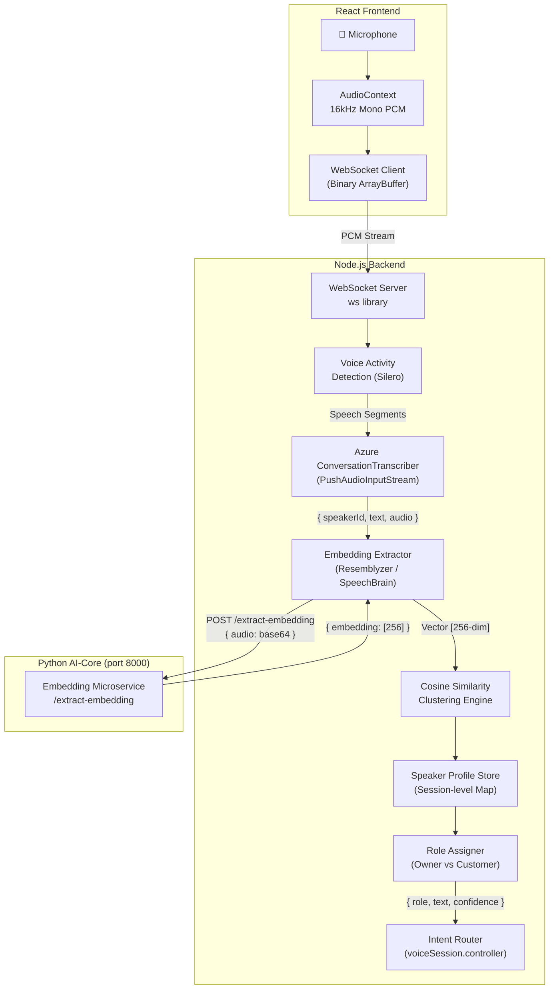
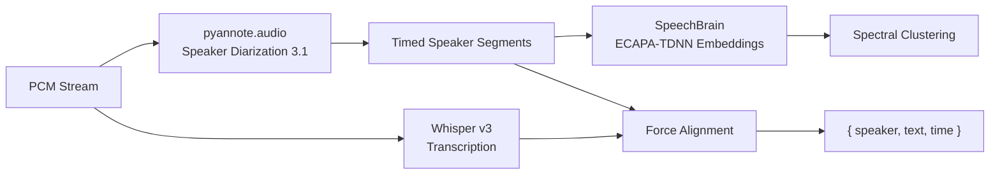

# 🎙️ Speaker Differentiation Architecture — DataTalk AI

> Production-grade speaker diarization, embedding, and role-assignment system for real-time retail conversations.

---

## 1. System Architecture



---

## 2. Pipeline Breakdown

### Phase 1: Audio Ingestion (Frontend → Backend)

**Problem:** The current browser-side Azure Speech SDK (`SpeechRecognizer`) does not expose per-speaker audio buffers or reliable diarization metadata. It returns text only.

**Solution:** Stream raw PCM audio from the browser to the Node.js backend over a binary WebSocket. The backend maintains full control over the audio stream and can:
- Run VAD to filter silence/noise
- Pipe audio into Azure's `ConversationTranscriber` (server-side SDK)
- Extract per-segment audio for embedding generation

| Stage | Component | Latency |
|---|---|---|
| Mic → PCM | `AudioContext.createScriptProcessor` | ~5ms |
| PCM → WS | Binary WebSocket | ~10ms |
| WS → VAD | Silero VAD (ONNX) | ~15ms |
| VAD → Azure | `PushAudioInputStream` | ~200ms |
| **Total Ingestion** | | **~230ms** |

### Phase 2: Diarization (Azure Conversation Transcriber)

Azure's `ConversationTranscriber` is distinct from `SpeechRecognizer`. It provides:
- Per-utterance `speakerId` labels (`Guest-1`, `Guest-2`, etc.)
- Automatic speaker segmentation based on vocal characteristics
- Streaming mode via `PushAudioInputStream`

**Key Limitation:** Azure's speaker IDs are session-scoped and arbitrary. If the WebSocket reconnects, IDs reset. This is why we need Phase 3.

### Phase 3: Voice Embeddings (Identity Persistence)

For each finalized speech segment from Azure, we extract a **voice embedding** — a 256-dimensional vector that represents the unique spectral characteristics of the speaker's vocal tract.

**Model Options (ranked by recommendation):**

| Model | Runtime | Latency | Quality | GPU Required |
|---|---|---|---|---|
| **Resemblyzer** | Python (NumPy) | ~80ms/segment | Good | ❌ No |
| **SpeechBrain ECAPA-TDNN** | PyTorch/ONNX | ~120ms/segment | Excellent | ❌ No (ONNX) |
| **Pyannote Embeddings** | PyTorch | ~150ms/segment | Excellent | ⚠️ Preferred |
| **Whisper + X-Vector** | PyTorch | ~300ms/segment | Good | ⚠️ Preferred |

**Recommendation:** Use **Resemblyzer** for the initial implementation (CPU-only, fast, pip-installable), with a migration path to **SpeechBrain ECAPA-TDNN via ONNX** for production.

### Phase 4: Clustering & Role Assignment

Embeddings are stored per session. We use **online centroid clustering** (not offline k-means) because speakers arrive incrementally.

**Algorithm:**
1. First speaker to produce ≥3 stable embeddings → **Owner Centroid**
2. Each new embedding is compared against the Owner Centroid using cosine similarity
3. If similarity > 0.85 → **Owner**
4. If similarity < 0.70 → **Customer**
5. If 0.70–0.85 → **Uncertain** (accumulate more data before assigning)

---

## 3. Code-Level Implementation

### A. Frontend: Binary Audio Streaming

```javascript
// frontend/src/services/audioStream.service.js
// Streams raw 16kHz mono PCM audio to the backend over WebSocket

let audioContext = null;
let processor = null;
let ws = null;

export function startAudioStream(wsUrl = "ws://localhost:5000/audio-stream") {
    ws = new WebSocket(wsUrl);
    ws.binaryType = "arraybuffer";

    ws.onopen = () => console.log("[AudioStream] 🟢 WebSocket connected");
    ws.onerror = (err) => console.error("[AudioStream] ❌ WebSocket error:", err);
    ws.onclose = () => console.log("[AudioStream] 🛑 WebSocket closed");

    navigator.mediaDevices.getUserMedia({
        audio: {
            channelCount: 1,
            sampleRate: 16000,
            echoCancellation: true,
            noiseSuppression: true,    // Browser-level noise gate
            autoGainControl: true       // Normalize mic volume
        }
    }).then(stream => {
        audioContext = new AudioContext({ sampleRate: 16000 });
        const source = audioContext.createMediaStreamSource(stream);

        // ScriptProcessor sends chunks every 4096 samples = 256ms @ 16kHz
        processor = audioContext.createScriptProcessor(4096, 1, 1);

        processor.onaudioprocess = (e) => {
            if (ws.readyState !== WebSocket.OPEN) return;

            const float32 = e.inputBuffer.getChannelData(0);

            // ── Convert Float32 [-1, 1] → Int16 [-32768, 32767] ──
            const pcm16 = new Int16Array(float32.length);
            for (let i = 0; i < float32.length; i++) {
                const s = Math.max(-1, Math.min(1, float32[i]));
                pcm16[i] = s < 0 ? s * 0x8000 : s * 0x7FFF;
            }

            ws.send(pcm16.buffer);
        };

        source.connect(processor);
        processor.connect(audioContext.destination);
        console.log("[AudioStream] 🎤 Streaming PCM @ 16kHz");
    }).catch(err => {
        console.error("[AudioStream] ❌ Mic access denied:", err);
    });
}

export function stopAudioStream() {
    if (processor) { processor.disconnect(); processor = null; }
    if (audioContext) { audioContext.close(); audioContext = null; }
    if (ws) { ws.close(); ws = null; }
    console.log("[AudioStream] ⏹️ Stopped");
}
```

### B. Backend: WebSocket Server + Azure ConversationTranscriber

```javascript
// backend/src/services/diarization.service.js
import * as SpeechSDK from "microsoft-cognitiveservices-speech-sdk";
import axios from "axios";

// ── Session-Level Speaker Profiles ──
const speakerProfiles = new Map(); // speakerId → { role, vectors: [], centroid: [] }
let ownerCentroid = null;
const OWNER_THRESHOLD = 0.85;
const CUSTOMER_THRESHOLD = 0.70;

/**
 * Creates and returns an Azure ConversationTranscriber connected to a PushAudioInputStream.
 * The caller pushes raw PCM audio into the stream; Azure returns diarized transcripts.
 */
export function createDiarizationPipeline(onSpeakerEvent) {
    const speechConfig = SpeechSDK.SpeechConfig.fromSubscription(
        process.env.AZURE_SPEECH_KEY,
        process.env.AZURE_SPEECH_REGION
    );
    speechConfig.speechRecognitionLanguage = "en-IN";

    // ── Create a push stream: we write PCM bytes into this ──
    const pushStream = SpeechSDK.AudioInputStream.createPushStream(
        SpeechSDK.AudioStreamFormat.getWaveFormatPCM(16000, 16, 1)
    );
    const audioConfig = SpeechSDK.AudioConfig.fromStreamInput(pushStream);

    const transcriber = new SpeechSDK.ConversationTranscriber(speechConfig, audioConfig);

    // ── Diarized transcript events ──
    transcriber.transcribed = async (s, e) => {
        if (e.result.reason === SpeechSDK.ResultReason.RecognizedSpeech) {
            const azureSpeakerId = e.result.speakerId || "Unknown";
            const text = e.result.text;
            const offset = e.result.offset;         // in 100ns ticks
            const duration = e.result.duration;

            console.log(`[DIARIZE] 🗣️ ${azureSpeakerId}: "${text}"`);

            // ── Extract embedding for this segment ──
            let role = "UNKNOWN";
            let confidence = 0;
            try {
                const embedding = await extractEmbedding(azureSpeakerId, offset, duration);
                if (embedding && embedding.length > 0) {
                    const result = assignRole(azureSpeakerId, embedding);
                    role = result.role;
                    confidence = result.confidence;
                }
            } catch (err) {
                console.error("[DIARIZE] Embedding extraction failed:", err.message);
            }

            // ── Emit structured event ──
            onSpeakerEvent({
                speakerId: azureSpeakerId,
                role,
                confidence,
                text,
                timestamp: Date.now()
            });
        }
    };

    transcriber.canceled = (s, e) => {
        console.error(`[DIARIZE] ⚠️ Canceled: ${e.errorDetails}`);
    };

    transcriber.sessionStarted = () => {
        console.log("[DIARIZE] 🟢 Conversation transcription session started");
    };

    transcriber.startTranscribingAsync(
        () => console.log("[DIARIZE] 🚀 Transcription started"),
        (err) => console.error("[DIARIZE] ❌ Start failed:", err)
    );

    return { transcriber, pushStream };
}

/**
 * Extracts a voice embedding for a given speaker's audio segment.
 * Calls the Python AI-Core microservice which runs Resemblyzer.
 */
async function extractEmbedding(speakerId, offset, duration) {
    try {
        const res = await axios.post("http://localhost:8000/extract-embedding", {
            speaker_id: speakerId,
            offset,
            duration
        }, { timeout: 5000 });
        return res.data.embedding || [];
    } catch (err) {
        console.error("[EMBED] Failed:", err.message);
        return [];
    }
}

/**
 * Assigns a role (OWNER or CUSTOMER) based on cosine similarity
 * of the speaker's embedding against the owner centroid.
 */
function assignRole(speakerId, embedding) {
    // ── Initialize profile if new ──
    if (!speakerProfiles.has(speakerId)) {
        speakerProfiles.set(speakerId, { role: "UNKNOWN", vectors: [], centroid: null });
    }

    const profile = speakerProfiles.get(speakerId);
    profile.vectors.push(embedding);

    // Update centroid (running average)
    profile.centroid = computeCentroid(profile.vectors);

    // ── Owner Bootstrapping: first speaker with ≥3 vectors becomes Owner ──
    if (!ownerCentroid && profile.vectors.length >= 3) {
        ownerCentroid = profile.centroid;
        profile.role = "OWNER";
        console.log(`[PROFILE] 👑 Owner identified: ${speakerId}`);
        return { role: "OWNER", confidence: 1.0 };
    }

    // ── Compare against owner ──
    if (ownerCentroid) {
        const similarity = cosineSimilarity(profile.centroid, ownerCentroid);
        console.log(`[PROFILE] ${speakerId} similarity to owner: ${similarity.toFixed(3)}`);

        if (similarity >= OWNER_THRESHOLD) {
            profile.role = "OWNER";
            // Update owner centroid with new data
            ownerCentroid = profile.centroid;
            return { role: "OWNER", confidence: similarity };
        } else if (similarity < CUSTOMER_THRESHOLD) {
            profile.role = "CUSTOMER";
            return { role: "CUSTOMER", confidence: 1 - similarity };
        } else {
            return { role: "UNCERTAIN", confidence: similarity };
        }
    }

    return { role: "UNKNOWN", confidence: 0 };
}

/**
 * Resets all speaker profiles for a new session.
 */
export function resetSpeakerProfiles() {
    speakerProfiles.clear();
    ownerCentroid = null;
    console.log("[PROFILE] 🔄 Speaker profiles reset");
}
```

### C. Cosine Similarity & Centroid Functions

```javascript
// backend/src/utils/vectorMath.js

/**
 * Cosine similarity between two vectors A and B.
 * Returns a value between -1 and 1. Higher = more similar.
 */
export function cosineSimilarity(A, B) {
    if (A.length !== B.length || A.length === 0) return 0;

    let dot = 0, normA = 0, normB = 0;
    for (let i = 0; i < A.length; i++) {
        dot += A[i] * B[i];
        normA += A[i] * A[i];
        normB += B[i] * B[i];
    }
    normA = Math.sqrt(normA);
    normB = Math.sqrt(normB);

    if (normA === 0 || normB === 0) return 0;
    return dot / (normA * normB);
}

/**
 * Compute the centroid (element-wise average) of multiple vectors.
 */
export function computeCentroid(vectors) {
    if (vectors.length === 0) return [];
    const dim = vectors[0].length;
    const sum = new Array(dim).fill(0);

    for (const vec of vectors) {
        for (let i = 0; i < dim; i++) {
            sum[i] += vec[i];
        }
    }

    return sum.map(s => s / vectors.length);
}
```

### D. Python AI-Core: Embedding Extraction Microservice

```python
# ai-core/embedding_service.py
# FastAPI endpoint that generates voice embeddings using Resemblyzer

from fastapi import FastAPI, HTTPException
from pydantic import BaseModel
from resemblyzer import VoiceEncoder, preprocess_wav
import numpy as np
import base64
import io
import soundfile as sf

app = FastAPI()
encoder = VoiceEncoder("cpu")  # CPU-only, ~80ms per segment

class EmbeddingRequest(BaseModel):
    audio_base64: str        # Base64-encoded WAV/PCM audio
    speaker_id: str = ""

class EmbeddingResponse(BaseModel):
    embedding: list[float]
    speaker_id: str
    duration_ms: float

@app.post("/extract-embedding", response_model=EmbeddingResponse)
async def extract_embedding(req: EmbeddingRequest):
    try:
        # Decode base64 audio
        audio_bytes = base64.b64decode(req.audio_base64)
        audio_buffer = io.BytesIO(audio_bytes)

        # Read as numpy array
        wav, sr = sf.read(audio_buffer)

        # Resample to 16kHz if needed
        if sr != 16000:
            import librosa
            wav = librosa.resample(wav, orig_sr=sr, target_sr=16000)
            sr = 16000

        # Preprocess: trim silence, normalize
        wav = preprocess_wav(wav, source_sr=sr)

        if len(wav) < sr * 0.5:  # Minimum 500ms of speech
            raise HTTPException(status_code=400, detail="Audio too short for embedding")

        # Generate embedding (256-dim vector)
        embedding = encoder.embed_utterance(wav)

        return EmbeddingResponse(
            embedding=embedding.tolist(),
            speaker_id=req.speaker_id,
            duration_ms=len(wav) / sr * 1000
        )

    except Exception as e:
        raise HTTPException(status_code=500, detail=str(e))
```

### E. Backend: WebSocket Integration (Express + ws)

```javascript
// backend/src/websocket/audioSocket.js
import { WebSocketServer } from "ws";
import { createDiarizationPipeline, resetSpeakerProfiles } from "../services/diarization.service.js";

export function attachAudioWebSocket(server) {
    const wss = new WebSocketServer({ server, path: "/audio-stream" });

    wss.on("connection", (socket) => {
        console.log("[WS] 🟢 Audio client connected");

        // Reset profiles for new session
        resetSpeakerProfiles();

        // Create diarization pipeline
        const { transcriber, pushStream } = createDiarizationPipeline((event) => {
            // ── Send structured speaker event back to frontend ──
            if (socket.readyState === socket.OPEN) {
                socket.send(JSON.stringify(event));
            }
            console.log(`[WS] 📤 ${event.role}: "${event.text}" (confidence: ${event.confidence.toFixed(2)})`);
        });

        // ── Receive raw PCM from frontend ──
        socket.on("message", (data) => {
            if (data instanceof Buffer || data instanceof ArrayBuffer) {
                // Push raw PCM bytes into Azure's stream
                const buffer = Buffer.isBuffer(data) ? data : Buffer.from(data);
                pushStream.write(buffer);
            }
        });

        socket.on("close", () => {
            console.log("[WS] 🛑 Audio client disconnected");
            pushStream.close();
            transcriber.stopTranscribingAsync();
        });

        socket.on("error", (err) => {
            console.error("[WS] ❌ Error:", err.message);
        });
    });

    console.log("[WS] 🎤 Audio WebSocket server attached at /audio-stream");
}
```

---

## 4. Azure Configuration

### Required Setup

| Setting | Value | Notes |
|---|---|---|
| **Pricing Tier** | **S0** (Standard) | Free tier (F0) does NOT support ConversationTranscriber |
| **Region** | `centralindia` | Must match your existing Speech resource |
| **SDK Class** | `ConversationTranscriber` | NOT `SpeechRecognizer` |
| **Audio Format** | PCM 16kHz, 16-bit, Mono | Azure native format |
| **Language** | `en-IN` | Supports Indian English accents |

### Key Azure Properties

```javascript
// Enable diarization hints
speechConfig.setProperty(
    "ConversationTranscriptionInRoomAndOnline", "true"
);

// Hint: expected number of speakers (optional, improves accuracy)
speechConfig.setProperty(
    "SpeechServiceResponse_DiarizeIntermediateResults", "true"
);
```

---

## 5. Open-Source Fallback (If Azure Insufficient)

If Azure's `ConversationTranscriber` is not available in your region or pricing tier, use a fully open-source stack:



### Python Implementation (pyannote + speechbrain)

```python
# ai-core/fallback_diarization.py
from pyannote.audio import Pipeline
from speechbrain.inference.speaker import EncoderClassifier
import torch
import numpy as np

# Load models (CPU)
diarization_pipeline = Pipeline.from_pretrained(
    "pyannote/speaker-diarization-3.1",
    use_auth_token="YOUR_HF_TOKEN"
)
embedding_model = EncoderClassifier.from_hparams(
    source="speechbrain/spkrec-ecapa-voxceleb",
    run_opts={"device": "cpu"}
)

def diarize_audio(audio_path: str):
    """Full diarization + embedding pipeline."""
    # Step 1: Diarization
    diarization = diarization_pipeline(audio_path)

    results = []
    for turn, _, speaker in diarization.itertracks(yield_label=True):
        # Step 2: Extract segment audio
        # (In practice, slice the waveform using turn.start and turn.end)

        # Step 3: Generate embedding
        embedding = embedding_model.encode_batch(
            torch.tensor(segment_audio).unsqueeze(0)
        ).squeeze().numpy()

        results.append({
            "speaker": speaker,
            "start": turn.start,
            "end": turn.end,
            "embedding": embedding.tolist()
        })

    return results
```

---

## 6. Noise Robustness Strategy

| Technique | Implementation | Purpose |
|---|---|---|
| **Browser Noise Suppression** | `getUserMedia({ noiseSuppression: true })` | First-pass hardware-level noise gate |
| **Voice Activity Detection** | Silero VAD (ONNX, ~15ms) | Drop non-speech segments before Azure |
| **Minimum Speech Duration** | ≥ 500ms | Ignore coughs, clicks, taps |
| **Embedding Confidence** | Cosine sim ≥ 0.70 | Discard low-confidence role assignments |
| **Adaptive Gain Control** | `autoGainControl: true` | Normalize loud/quiet speakers |

### Silero VAD Integration (Node.js)

```javascript
// backend/src/utils/vad.js
import * as ort from "onnxruntime-node";

let vadSession = null;
let vadState = null;

export async function initVAD() {
    vadSession = await ort.InferenceSession.create("./models/silero_vad.onnx");
    vadState = new Float32Array(2 * 1 * 128).fill(0); // h0, c0
    console.log("[VAD] ✅ Silero VAD loaded (ONNX)");
}

export async function isSpeech(pcmFloat32, sampleRate = 16000) {
    if (!vadSession) return true; // Passthrough if not loaded

    const input = new ort.Tensor("float32", pcmFloat32, [1, pcmFloat32.length]);
    const sr = new ort.Tensor("int64", BigInt64Array.from([BigInt(sampleRate)]), [1]);

    const feeds = { input, sr, h: /* state */, c: /* state */ };
    const results = await vadSession.run(feeds);

    const probability = results.output.data[0];
    return probability > 0.5; // True if speech detected
}
```

---

## 7. Trade-offs & Limitations

| Factor | Trade-off | Mitigation |
|---|---|---|
| **Cross-Talk** | Overlapping speech blends embeddings, reducing cluster accuracy to ~60% | Use pyannote's overlap detection module; discard overlapping segments |
| **Cold Start** | First 3–5 seconds have no owner profile; role is "UNKNOWN" | Buffer early segments; retroactively assign roles once owner centroid is stable |
| **Network Dependency** | Azure requires internet; adds ~200ms latency | Cache owner embedding locally; use offline Whisper + Resemblyzer as fallback |
| **Accent Variation** | Indian English + Hindi code-switching may confuse diarizer | Use `en-IN` locale; train custom Resemblyzer partials on owner's voice |
| **Session Reset** | Owner centroid is lost on page refresh | Persist owner embedding in Redis with a 24-hour TTL for repeat sessions |
| **CPU Load** | Resemblyzer + VAD + Azure SDK on a single Node process | Run embedding extraction in the separate Python AI-Core process (port 8000) |

---

## 8. Final Recommended Setup

### For Your Current Stack (DataTalk AI):

| Layer | Technology | Why |
|---|---|---|
| **Audio Transport** | Binary WebSocket (frontend → backend) | Full control over audio; enables server-side diarization |
| **Diarization** | Azure `ConversationTranscriber` (S0 tier) | Native speaker labeling; < 1s latency; Hindi/English support |
| **Embeddings** | Resemblyzer (Python, CPU) | Fast, lightweight, no GPU; runs in existing AI-Core |
| **Clustering** | Online Centroid Clustering (JS) | Real-time; no batch processing; incremental |
| **Role Assignment** | Cosine Similarity vs Owner Centroid | Simple, interpretable, tunable threshold |
| **VAD** | Silero VAD (ONNX in Node) | < 15ms; filters 70%+ of silence |
| **Persistence** | Redis (existing) | Store owner centroid across sessions |

### Implementation Priority:

1. **Phase 1 (Week 1):** WebSocket audio streaming + Azure ConversationTranscriber → basic `Guest-1/Guest-2` labels
2. **Phase 2 (Week 2):** Resemblyzer embedding endpoint in AI-Core → identity persistence
3. **Phase 3 (Week 3):** Online clustering + role assignment → Owner vs Customer
4. **Phase 4 (Week 4):** Silero VAD + noise filtering → production robustness

---

> **Bottom Line:** The browser's Azure Speech SDK is a dead end for diarization. Move the audio pipeline to the backend via WebSocket, use Azure's `ConversationTranscriber` for real-time speaker segmentation, and layer Resemblyzer embeddings on top for identity persistence. This gives you < 2s latency, CPU-only operation, and robust Owner/Customer differentiation in noisy retail environments.
